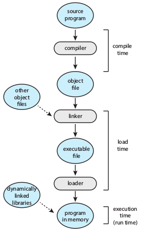
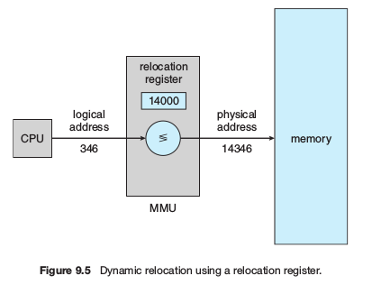

# Chapter 9 - Memory

<!-- TOC -->

- [Chapter 9 - Memory](#chapter-9---memory)
	- [9.1 Background](#91-background)
		- [9.1.1 Basic Hardware](#911-basic-hardware)
			- [Base and Limit](#base-and-limit)
		- [9.1.2 Address Binding](#912-address-binding)
		- [9.1.2 Logical Versus Physical Address Space](#912-logical-versus-physical-address-space)
		- [9.1.4 Dynamic Loading](#914-dynamic-loading)
		- [9.1.4 Dynamic Linking and Shared Libraries](#914-dynamic-linking-and-shared-libraries)
	- [9.2 Contiguous Memory](#92-contiguous-memory)
		- [9.2.1 Memory Protection](#921-memory-protection)
		- [9.2.2 Memory Allocation](#922-memory-allocation)
		- [9.2.3 Fragmentation](#923-fragmentation)
	- [9.3 Paging](#93-paging)
		- [9.3.1 Basic Method](#931-basic-method)
		- [9.3.2 Hardware Support](#932-hardware-support)
		- [9.3.3 Protection](#933-protection)
		- [9.3.4 Shared Pages](#934-shared-pages)
	- [9.4 Structure of the Page Table](#94-structure-of-the-page-table)
		- [9.4.1 Hierarchical Paging](#941-hierarchical-paging)
		- [9.4.2 Hashed Page Tables](#942-hashed-page-tables)
		- [9.4.3 Inverted Page Tables](#943-inverted-page-tables)
		- [9.4.4 Oracle SPARC Solaris](#944-oracle-sparc-solaris)
	- [9.5 Swapping](#95-swapping)
		- [9.5.1 Standard Swapping](#951-standard-swapping)
		- [9.5.2 Swapping with Paging](#952-swapping-with-paging)
		- [9.5.3 Swapping on Mobile Systems](#953-swapping-on-mobile-systems)
	- [9.6 Example: Intel 32- and 64-bit Architecture](#96-example-intel-32--and-64-bit-architecture)
		- [9.6.1 IA-32 Architecture](#961-ia-32-architecture)
		- [9.6.2 x86-64](#962-x86-64)
	- [9.7 Example: ARMv8 Architecture](#97-example-armv8-architecture)
	- [9.8 Summary](#98-summary)

<!-- /TOC -->

## 9.1 Background

**Memory consists of a large array of bytes, each with its own address.**

A typical instruction-execution cycle:

- Fetch an instruction from memory
  - CPU check the address in the PC (Program Counter)
- Decode the instruction
  - This may cause operands to be fetched from memory
- Store results back in memory

We can ignore _how_ a program generates memory addresses.

### 9.1.1 Basic Hardware

The CPU can only access Main memory and registers directly. Instructions take memory addresses as arguments, not disk addresses. So Any data that need to be use must be moved from higher level memory into either main memory of a register.

Registers can be accessed within one clock cycle. Accessing main memory takes a transaction over the memory bus, and may take many clock cycles to complete.

When the CPU is waiting on memory accesses necessary to complete and instruction it must **stall**. This is not tolerable due to the frequency of memory references.

The solution to _stalling_ is to have a fast memory **cache** in between the CPU and the Main Memory, usually on the CPU its self.

We are not only concerned with the relative access speed of physical memory, but also ensuring correct operation. We have to protect the operating systems from access by user processes and user processes from one another. This protecton must come from the hardware, as the penalty for the OS intervening is to high.

Hardware can implement this protection in several different ways. The key to all of these methods is ensureing that processes have separate, unique memory spaces. This is done in different ways, but requires the hardware to define a range of safe legal addresses that a process can access.

#### Base and Limit

- Uses two registers, Loaded only by the OS
  - Base Register (BR)
  - Limit Register (LR)
- The BR holds the lowest legal memory address
- The LR holds the largest legal memory address
- The process can access anything between the two registers
  - Making the processes memory size LR-BR = Size
- The CPU compares every address generated by the user with these two registers.

This structure prevents user programs from (intentionally or unintentionally) modifying the code or data structures of either the OS or other User programs.

### 9.1.2 Address Binding

In most cases a user process goes through several steps (some of which are optional) before being executed. Addresses are typically symbolic in the source program. A compiler **binds** these symbolic addresses to relocatable addresses (14 bytes from the beginning of the module). The _linker_ or _loader_ in turn binds the relocatable addresses to absolute addresses. Each binding is a mapping from on addresses space to another.

The binding of instructions and data to memory addresses can be done at any step along the way:

- **Compile Time**
  - If you know where the process will reside in memory at compile time you can generate **absolute code**.
  - If at any time the starting location of this code changes, it will need to be recompiled.

- **Load Time**
  - If it is not known at compile time where the process will reside in memory, the compiler must generate **relocatable code**
  - Final binding is delayed until load time
  - If the starting address changes, only need to reload the user code to incorporated this changed value
- **Execution Time**
  - If the process can be moved during its execution from one memory segment to another, then binding is delayed until run time.
  - Special hardware must be available for this scheme to work.
  - _Most operating systems use this method_

### 9.1.2 Logical Versus Physical Address Space

An address generated by the CPU is commonly referred to as a **logical address**.

An address seen by the memory unity (loaded into the **memory-address register**) is commonly referred to as a **physical address**.

Binding addresses at either compile or load time generates _identical_ logical and physical addresses. 

The execution-time address-binding scheme results in differing logical and physical addresses. In this case we usually refer to the logical address as a **virtual address**.

**Logical Address Space** - set of al logical addresses generated by a program.

**Physical Address Space** - set of all physical addresses corresponding to the addresses in the logical address space.

Runtime mapping of virtual to physical addresses is done by a hardware device called the **memory-management unit**(MMU). This mapping can be done using different methods. When using the Base and Limit method, the base register is called a **relocation register**.

The user program can never access a real physical address. When a user program accesses a memory address it is relocated relative to the relocation register. Logical addresses are converted to Physical addresses by a hardware mapping device.

> **The location of a referenced memory address is not determined until the reference is made.**

### 9.1.4 Dynamic Loading

**Dynamic Loading** - instead of storing all data and code in memory we can load it into memory as needed to obtain better memory-space utilization. Routines will not be loaded until called. _**Occurs at runtime.**_

Process of Dynamic Loading:

- All Routines are stored on disk in a relocatable format
- The main program is loaded into memory and is executed
- When a routine needs to call another routine, the calling routine first checks to see whether the other routine has been loaded. 
  - If it has not, the relocatable linking loader is called to load the desired routine into memory and to update the program’s address tables to reflect this change.
- Then control is passed to the newly loaded routine.

The advantage here is that a routine is only loaded if needed. This is particularly useful for large amounts of code needed for handling infrequent cases (Error Handling).

Dynamic loading does not require OS support. It is up to the user to design programs that make use of this. OS's may provide library routines to implement dynamic loading.

### 9.1.4 Dynamic Linking and Shared Libraries

**Dynamically Linked Libraries**(DLLs) - system libraries that are linked to user programs when they a run, also known as _shared libraries_. Dynamic linking is similar to _dynamic loading_. _**Occurs at execution time**._

Some operating systems only support **static linking**, in which system libraries are combined by the loader into the binary image.

A second advantage of DLLs is that they can be shared among multiple processes, so only on instance of the DLL is in main memory.

When a routine is referenced in a dynamic library, the loader locates the DLL, loading it into memory if necessary. It then adjusts addresses that reference functions in the dynamic library to the location in memory where the DLL is stored.

## 9.2 Contiguous Memory

### 9.2.1 Memory Protection

### 9.2.2 Memory Allocation

### 9.2.3 Fragmentation

## 9.3 Paging

### 9.3.1 Basic Method

### 9.3.2 Hardware Support

### 9.3.3 Protection

### 9.3.4 Shared Pages

## 9.4 Structure of the Page Table

### 9.4.1 Hierarchical Paging

### 9.4.2 Hashed Page Tables

### 9.4.3 Inverted Page Tables

### 9.4.4 Oracle SPARC Solaris

## 9.5 Swapping

### 9.5.1 Standard Swapping

### 9.5.2 Swapping with Paging

### 9.5.3 Swapping on Mobile Systems

## 9.6 Example: Intel 32- and 64-bit Architecture

### 9.6.1 IA-32 Architecture

### 9.6.2 x86-64

## 9.7 Example: ARMv8 Architecture

## 9.8 Summary